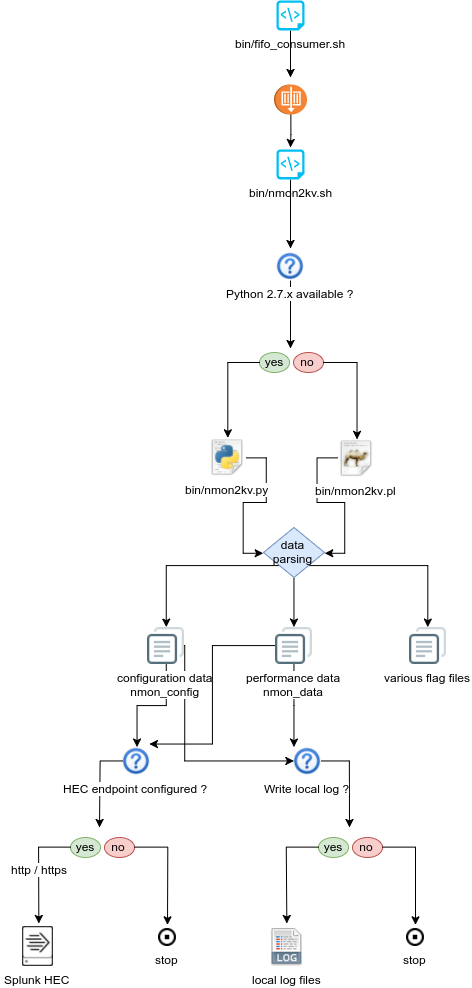

#############################
Processing workflow in action
#############################

====================
Generating Nmon data
====================

Generating the Nmon data which basically contains the performance measures and the configuration data is called "nmon_collect".

**The activity of the scripts involves in these operations is being logged by Splunk into:**

* sourcetype=nmon_collect: for standard output
* index=_internal sourcetype=splunkd: for stderr (unexpected errors)

**Most of these operations are done by the main script: bin/nmon_helper.sh:**

*************************************************
nmon_helper.sh tasks part1: initial startup tasks
*************************************************

.. image:: img/nmon_helper_part1.png
   :alt: nmon_helper_part1.png
   :align: center

**Steps are:**

* basics startup tasks: load SPLUNK_HOME variable, identify the application directories
* directory structure: load and verify directory structure, create if required in $SPLUNK_HOME/var/log/nmon
* binaries caching: for Linux OS only, verify if cache is existing and up to date, unpack linux.tgz to $SPLUNK_HOME/var/log/nmon if required
* start loading default and custom configurations

***************************************************
nmon_helper.sh tasks part2: load values and options
***************************************************

.. image:: img/nmon_helper_part2.png
   :alt: nmon_helper_part2.png
   :align: center

**Steps are:**

* load hard coded values for nmon options, such as interval and snapshot values
* load default/nmon.conf values (source default/nmon.conf)
* check if local/nmon.conf exist, and source file (override any previously defined values)
* check if /etc/nmon.conf exist (provide override mechanism at local server level), and source file (override any previously defined values)

**********************************************
nmon_helper.sh tasks part3: identify instances
**********************************************

.. image:: img/nmon_helper_part3.png
   :alt: nmon_helper_part3.png
   :align: center

**Steps are:**

* Identify Operating System
* Verify PID file existence
* Is PID file valid ?
* If PID file exists, is the nmon instance running ?
* If PID not found, is there an nmon instance running ?
* rewrite PID file if nmon is running
* trigger nmon startup in other cases

*********************************************
nmon_helper.sh tasks part4: identify binaries
*********************************************

.. image:: img/nmon_helper_part4.png
   :alt: nmon_helper_part4.png
   :align: center

**Steps are:**

* Identify Operating System
* Identify Processor architecture for Linux / Solaris
* Identify local nmon binary for AIX
* For Linux, verify embedded binaries priority
* For Linux, identify best binary candidate and set nmon binary
* For Solaris, set sarmon binary

***********************************
nmon_helper.sh tasks part5: startup
***********************************

.. image:: img/nmon_helper_part5.png
   :alt: nmon_helper_part5.png
   :align: center

**Steps are:**

* Idenfity fifo_reader running
* set the nmon destination (fifo1 / fifo2)
* start nmon binary
* Identify interpreter to be used
* start the fifo_reader

===================
Consuming Nmon data
===================

Consuming the nmon data generated by the nmon_helper.sh and associated scripts (fifo_reader) is in first step operated by the "bin/fifo_consumer.sh" script.

This is a very simple shell script that will recompose the nmon data in the correct order, and stream its content to nmon parsers. (nmon2kv)

This script does as well the files rotation, such that next cycle starts such that the nmon_data.dat file is empty after consumption, which guarantees a low level of CPU and resources usage over each iteration.

.. image:: img/fifo_consumer.png
   :alt: fifo_consumer.png
   :align: center

**Steps are:**

* Initialization and configuration loading
* Verify if fifo1 and fifo2 have rotated data to be proceeded
* Verify if fifo1 and fifo2 have non empty nmon_data.dat
* If so, wait at least 5 seconds age file before processing the data
* Stream nmon data to nmon2kv.sh

=================
Parsing Nmon data
=================

This is the final step in the nmon processing tasks, the nmon2kv parsers will consume the data receive in standard input (stdin), and stream to the Splunk HEC endpoint over http/https.

**There 3 scripts involved in these tasks:**

* bin/nmon2kv.sh: simple shell wrapper that will decide to use Python or Perl parser
* bin/nmon2kv.py: the Python version parser
* bin/nmon2kv.pl: the Perl version parser

**Steps are:**

* nmon2kv.sh reads data from standard input
* nmon2kv.sh decides to use Python if version 2.7.x.available, or fall back to Perl
* nmon2kv.py|.pl parse the data, generates configuration and performance data, as well as internal flag files
* If the HEC endpoint has been configured (URL and token defined in local/nmon.conf), stream the data to the HEC endpoint
* If the option "--no_log_local" is used, the parser does not write to local log files on the machine. Otherwise, write the data to local logs in $SPLUNK_HOME/var/log/nmon
