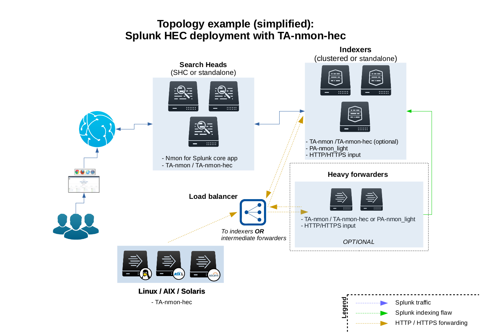
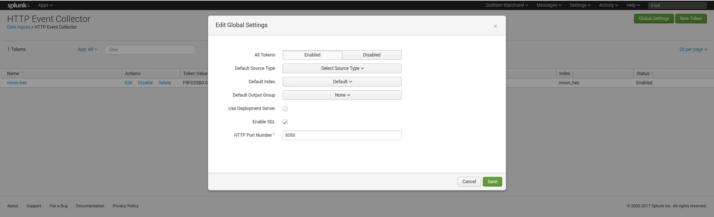
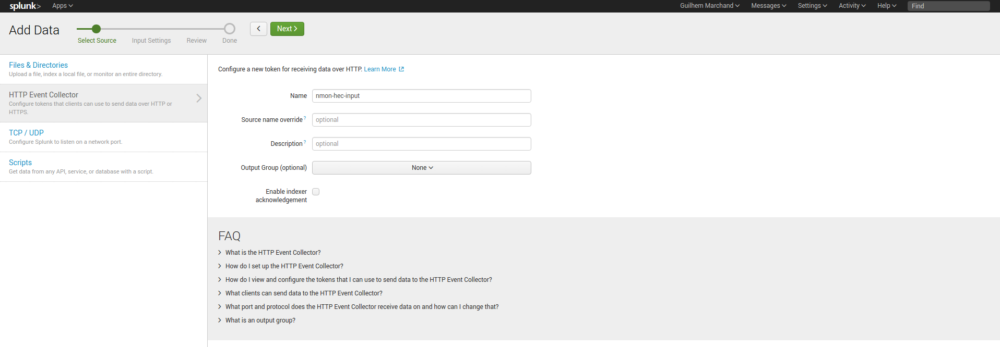
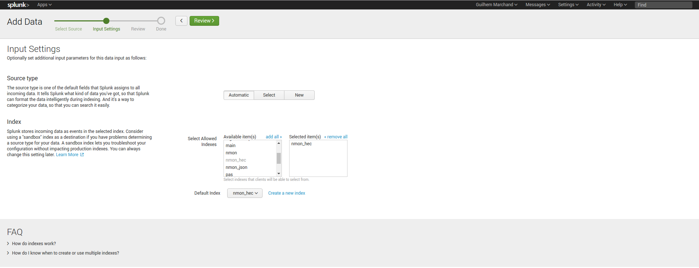
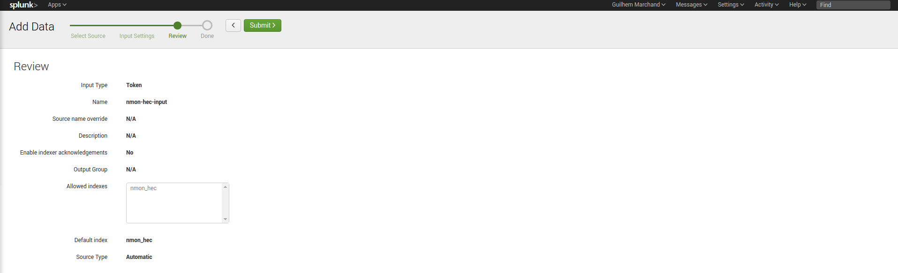

##########
Deployment
##########

**However, Splunk is an highly distributable solution and some good practices have to be respected, please consult the Nmon Performance core documentation:**

* Standalone deployment: http://nmon-for-splunk.readthedocs.io/en/latest/installation_standalone.html

* Distributed deployment: http://nmon-for-splunk.readthedocs.io/en/latest/installation_distributed.html

* Splunk Cloud deployment: http://nmon-for-splunk.readthedocs.io/en/latest/installation_splunkcloud.html

**A Splunk HEC has several advantages:**

* **server easy set up:** Splunk http input is easy to configure and implement
* **secure:** Splunk http traffic can easily be encrypted via SSL and integrated into any DMZ or similar restricted networking layer
* **resilient and scalable:** using load balancers and multiple nodes provides resiliency and horizontal scalability
* **network friendly:** as a Web service, it can be easily used across wide networks and over the Internet
* **easy management:** since the http input is managed on a token basis, you can easily configure different tokens to ingest the data into different indexes without any package modification or complexity

******************************
HEC performance considerations
******************************

**For best HEC performance purposes, the nmon-logger works the following way:**

* performance and configuration data are streamed in "batch" mode, which means we only generate one HEC connection for each during an occurrence of the nmon_processing (which occurs every minute)
* collection, processing and other data being generated by the nmon-logger work as well in batch mode, one connection per processing streams the full data
* most of Metadata are part of each event sent to the HEC

**See:** http://dev.splunk.com/view/event-collector/SP-CAAAE73

******************************
HEC resiliency and scalability
******************************

The TA-nmon-hec does not implement any kind of resilient mechanism to prevent against data loss during the transport to your HEC endpoint. (if your http endpoint is not available, the data will not be re-sent and will be lost)

Instead of that, we rely on the http/https HEC endpoint high resiliency you should implement when configuring your HEC implementation, which is quite straightforward.

**In other words, ensure that you create a load balanced Web service (HA-proxy, nginx, F5 BigIp, etc...) such that you always have multiple http endpoints available, for resiliency and horizontal scalability.**

*************************************************
Activate the Splunk http input and create a token
*************************************************

**The Splunk configuration is really straightforward, it is all about:**

* Activating and the http input: configuring the http port, choosing between http and https
* Creating a token for the nmon data (1 token for all data, but you can create multiple tokens for different servers deployement)

**Notes:**

* http and https are supported
* indexer acknowledgment is not currently supported (configured per token)
* the nmon-logger will not explicitly specify an index, you choose the index to be used on a per token basis
* Any index name starting by "nmon" is natively taken in charge by the Nmon Performance application
* If you choose a different index name that does not match the rule above, you just need to customize the eventtypes.conf and macros.conf of the Nmon app
* it is not required to define any sourcetype / source by default

**In a nutshell:**

**Configuration files:**

* "$SPLUNK_HOME/etc/apps/splunk_http_input/local/inputs.conf":

::

    [http]
    disabled = 0

* "$SPLUNK_HOME/etc/apps/<appname>/local/inputs.conf":

*Notes: replace <appname> with the application context where you want to store the configuration inputs.conf file*

::

    # inputs.conf

    # Enable the HEC
    [http]
    disabled = 0
    enableSSL = 1

    # HEC endpoint for clients
    [http://nmon-hec-input]
    disabled = 0
    index = nmon_hec
    indexes = nmon_hec
    token = CEE56643-BA2D-48EE-94EF-AD0909718B2A

*************************
Deploying the TA-nmon-hec
*************************

When the TA-nmon-hec has been deployed to Splunk, no data will be available in Splunk as long as you don't configure the HEC parameters.

**The TA-nmon-hec expects your configuration in:**

::

    $SPLUNK_HOME/etc/apps/TA-nmon-hec/local/nmon.conf

**Create a local/nmon.conf and insert your URL / Token:**

*Example:*

::

    # HEC server configuration

    nmon2csv_options="--mode fifo --silent --no_local_log --splunk_http_url https://192.168.33.100:8088/services/collector/event --splunk_http_token CEE56643-BA2D-48EE-94EF-AD0909718B2A"

**To deploy the TA-nmon-hec using the Splunk deployment server, you will:**

* extract the TA-nmon-hec archive in $SPLUNK_HOME/etc/deployment-apps/ of your deployment server
* create the $SPLUNK_HOME/etc/deployment-apps/TA-nmon-hec/local/nmon.conf and insert your HEC parameters
* associate the TA-nmon-hec with the relevant service class and deploy the TA to your servers (Ensure to set "restart splunkd" !)

Once Splunk is restarted, the collection starts and if you have properly configured your HEC endpoint, the data starts to be available in Splunk.

Et voila!

